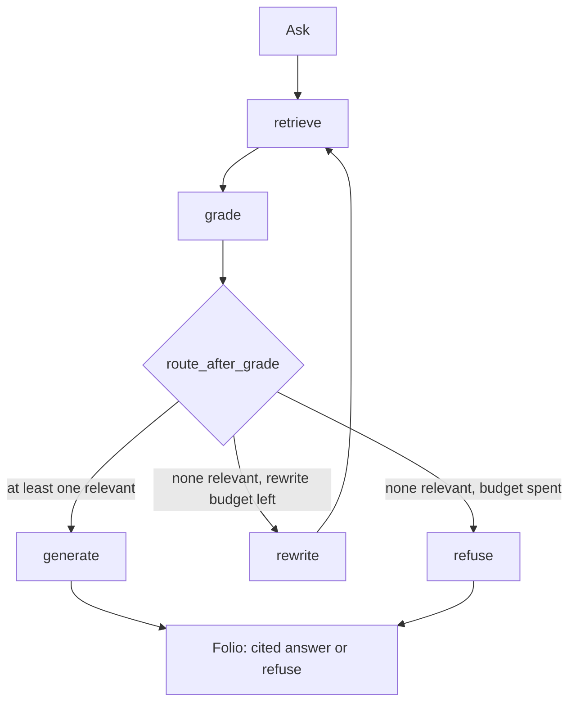

# Tether

Tether is cite-or-refuse Corrective RAG over a local IETF RFC corpus (IPv4, TCP, URI, HTTP). It retrieves passages, grades them, optionally rewrites the query, then either answers with numbered footnotes or refuses. It does not guess from model memory.

**Who it is for.** Anyone who needs to show that an LLM answer is tied to retrieved text — resume reviewers, interviewers, and anyone tired of fluent hallucinations. The problem it attacks is uncited generation: if the local corpus cannot support a claim, the desk refuses instead of inventing a footnote.

**Stack.** FastAPI, LangGraph, Chroma on disk, React + Vite, FastRouter or an OpenAI-compatible chat API. No hosted database. The index lives at `backend/data/chroma`. Never commit `.env`.



## Windows runbook (PowerShell)

Repo path: `C:\Users\Joshua\grounded-rag`. Use **two terminals**. Do not run `npm` from `backend`.

### 1. Env

```powershell
cd C:\Users\Joshua\grounded-rag
Copy-Item .env.example .env
notepad .env
```

Paste `FASTROUTER_API_KEY` and/or `OPENAI_API_KEY`. Chat and embeddings use FastRouter when that key is set (`text-embedding-3-small` works there). To force OpenAI embeddings while chat stays on FastRouter, set `EMBEDDING_BASE_URL` and `EMBEDDING_API_KEY`. Do not commit `.env`. Restart the API after editing `.env`.

### 2. Backend venv (once)

```powershell
cd C:\Users\Joshua\grounded-rag
python -m venv backend\.venv
.\backend\.venv\Scripts\Activate.ps1
pip install -r backend\requirements.txt
```

### 3. Two terminals

If scripts are blocked: `Set-ExecutionPolicy -Scope Process Bypass`

**Terminal 1 — API** (`http://127.0.0.1:8000`)

```powershell
cd C:\Users\Joshua\grounded-rag
.\scripts\dev-api.ps1
```

That sets `PYTHONPATH` to `backend` and runs `python -m uvicorn app.main:app --reload --host 127.0.0.1 --port 8000`.

Equivalent by hand:

```powershell
cd C:\Users\Joshua\grounded-rag\backend
.\.venv\Scripts\Activate.ps1
$env:PYTHONPATH = "."
python -m uvicorn app.main:app --reload --host 127.0.0.1 --port 8000
```

**Terminal 2 — web** (`http://127.0.0.1:5173`)

```powershell
cd C:\Users\Joshua\grounded-rag
.\scripts\dev-web.ps1
```

Vite binds **127.0.0.1** (Windows `localhost` can be IPv6-only) and proxies `/api` to port 8000.

### 4. Ingest, then ask

Empty index: `GET /api/health` has `index_ready: false`. Ask returns **409** until you ingest (desk button **Ingest corpus**, or `POST /api/ingest`). CLI ingest, from `backend` with `PYTHONPATH=.`:

```powershell
python -m app.ingest
```

Grounded (should cite RFCs):

- How many bits is the IPv4 version field, and what does Time to Live mean?
- What default TCP ports do the http and https URI schemes use?

Refuse (no fake footnotes):

- Who won the 2018 FIFA World Cup?

## Tests and evals

From `backend` with the venv active and `$env:PYTHONPATH = "."`:

```powershell
cd C:\Users\Joshua\grounded-rag\backend
pytest
python evals\run_eval.py --skip-llm
python evals\run_eval.py
```

`--skip-llm` scores retrieval gold only (needs an ingested index). Full eval calls the live LLM.

## Docs

- [`docs/ARCHITECTURE.md`](docs/ARCHITECTURE.md) — request flow, graph, env, on-disk layout
- [`docs/DESIGN.md`](docs/DESIGN.md) — desk + folio UI contract
- [`docs/STUDY.md`](docs/STUDY.md) — interview notes (chunking, CRAG, metrics, failure modes)
