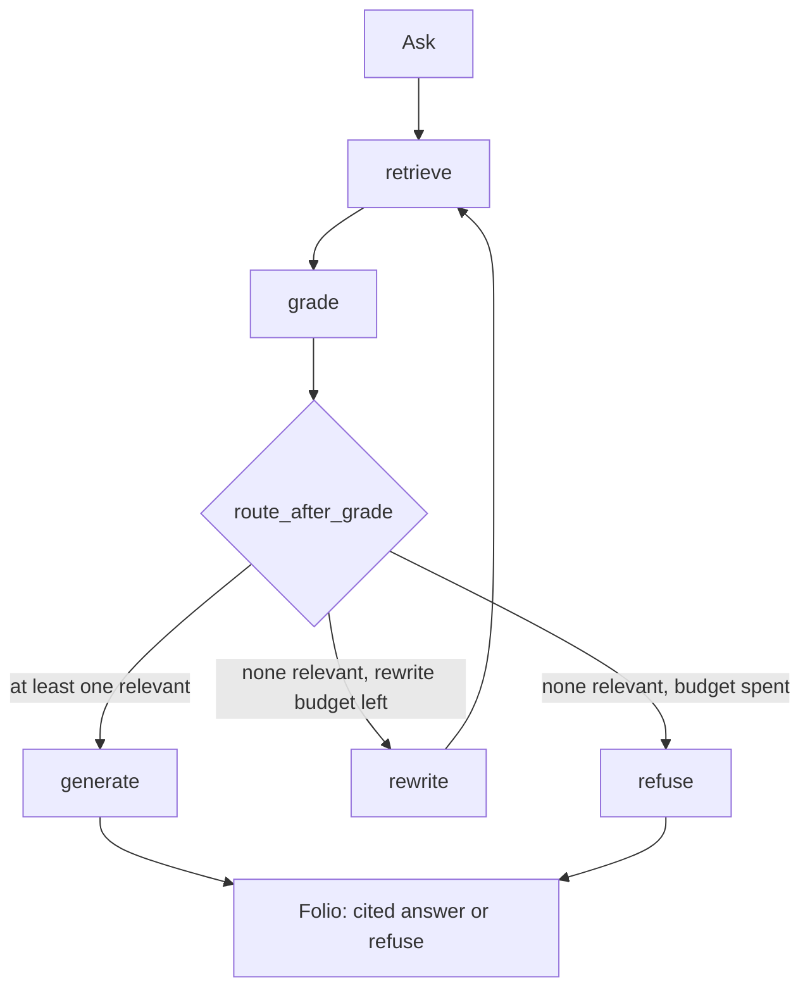

# Tether

Tether is cite-or-refuse Corrective RAG over a local IETF RFC corpus (IPv4, TCP, URI, HTTP). It retrieves passages, grades them, optionally rewrites the query, then either answers with numbered footnotes or refuses. It does not guess from model memory.

**Who it is for.** Anyone who needs to show that an LLM answer is tied to retrieved text — resume reviewers, interviewers, and anyone tired of fluent hallucinations. The problem it attacks is uncited generation: if the local corpus cannot support a claim, the desk refuses instead of inventing a footnote.

**Stack.** FastAPI, LangGraph, Chroma on disk, React + Vite, FastRouter or an OpenAI-compatible chat API. No hosted database. The index lives at `backend/data/chroma`. Never commit `.env`.



## Windows runbook (PowerShell)

Two terminals. Repo path is `C:\Users\Joshua\grounded-rag`.

### 1. Env

```powershell
cd C:\Users\Joshua\grounded-rag
Copy-Item .env.example .env
notepad .env
```

Paste `FASTROUTER_API_KEY` and/or `OPENAI_API_KEY`. If both are set, chat uses FastRouter and embeddings use OpenAI (see `docs/ARCHITECTURE.md`). Do not commit `.env`.

### 2. Backend venv

```powershell
cd C:\Users\Joshua\grounded-rag
python -m venv backend\.venv
.\backend\.venv\Scripts\Activate.ps1
pip install -r backend\requirements.txt
```

### 3. Ingest + API (terminal 1)

```powershell
cd C:\Users\Joshua\grounded-rag\backend
.\.venv\Scripts\Activate.ps1
$env:PYTHONPATH = "."
python -m app.ingest
python -m uvicorn app.main:app --reload --host 127.0.0.1 --port 8000
```

If the venv was created at `backend\.venv`, activate with `C:\Users\Joshua\grounded-rag\backend\.venv\Scripts\Activate.ps1`. You can skip the CLI ingest and use **Ingest corpus** in the UI after the API is up.

### 4. Frontend (terminal 2)

```powershell
cd C:\Users\Joshua\grounded-rag\frontend
npm install
npm run dev
```

Open [http://127.0.0.1:5173](http://127.0.0.1:5173). Vite proxies `/api` to `127.0.0.1:8000` and binds IPv4 on purpose (Windows `localhost` can be IPv6-only).

### 5. Try it

Grounded (should cite RFCs):

- How many bits is the IPv4 version field, and what does Time to Live mean?
- What default TCP ports do the http and https URI schemes use?

Refuse (corpus cannot answer):

- Who won the 2018 FIFA World Cup?

Empty index: health reports `index_ready: false`; Ask returns **409** until you ingest.

## Tests and evals

From `backend` with the venv active and `$env:PYTHONPATH = "."`:

```powershell
cd C:\Users\Joshua\grounded-rag\backend
pytest
python evals\run_eval.py --skip-llm
python evals\run_eval.py
```

`--skip-llm` scores retrieval gold only (needs an ingested index). Full eval calls the live LLM.

## Docs

- [`docs/ARCHITECTURE.md`](docs/ARCHITECTURE.md) — request flow, graph, env, on-disk layout
- [`docs/DESIGN.md`](docs/DESIGN.md) — desk + folio UI contract
- [`docs/STUDY.md`](docs/STUDY.md) — interview notes (chunking, CRAG, metrics, failure modes)
